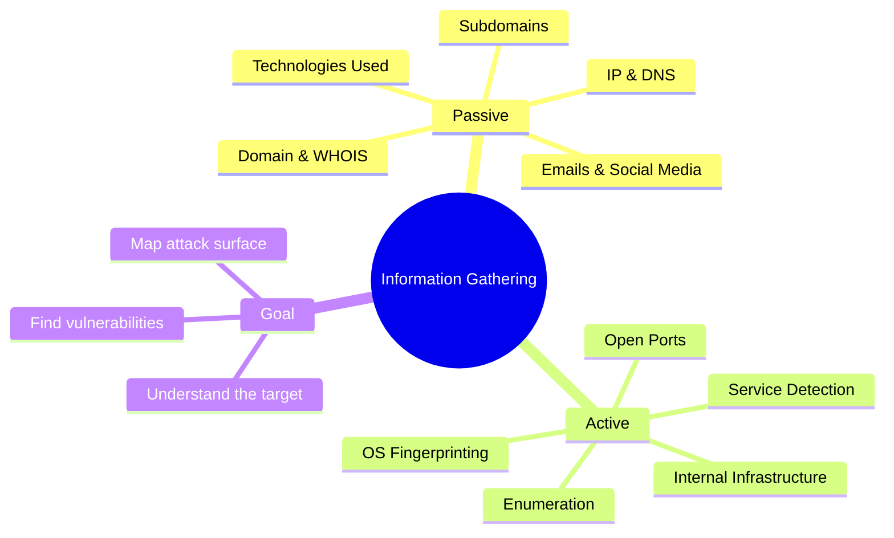
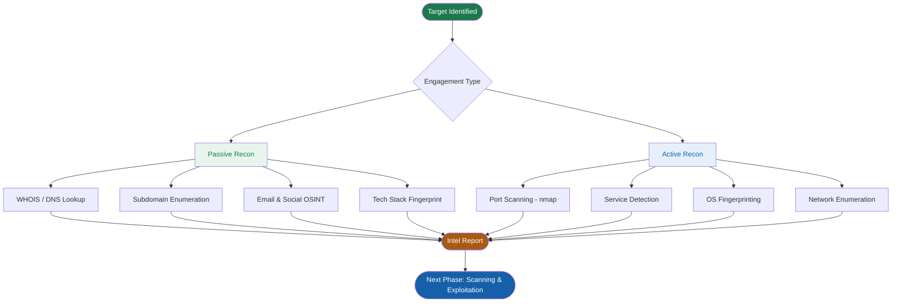

#  Information Gathering 

> [!abstract] TL;DR Information Gathering = **Reconnaissance**. It is the **first phase** of any penetration test. Collect everything you can about a target — IP, DNS, tech stack, emails, ports — before touching anything. The more you know, the more successful you'll be in later stages.

---

##  What Is Information Gathering?

Information Gathering (also called **Reconnaissance**) involves **systematically collecting data** about:

- A target **website**
- A target **individual**
- A target **company**
- A target **system or network**

###  Goal of This Phase

> [!goal] Why It Matters In this phase you identify:
> 
> - What **web technologies** are used on the target site
> - Any **vulnerabilities** present
> - The **IP address** of the hosting server
> - A full picture of **what you are targeting**
> 
>  _More information = more success in later stages._

---

##  Two Types of Reconnaissance

### Overview

| Type        | Contact with Target? | Detectability                  | Legal Risk           |
| ----------- | -------------------- | ------------------------------ | -------------------- |
| **Passive** |  None                | Very low — leaves no trace     | Lower within scope   |
| **Active**  | Direct engagement    | Detectable by IDS/IPS/Firewall | Must be within scope |

---

###  Passive Information Gathering

> [!info] Definition Gathering as much information as possible **without actively engaging** with the target. Uses only public sources (OSINT).

**What to look for:**

-  Identifying **IP addresses** and **DNS information**
-  Identifying **Domain names** and **Domain ownership** information (WHOIS)
-  Identifying **Email addresses** and **Social media profiles**
-  Identifying **technologies** used on the targeted site
-  Identifying **Subdomains**

**Tools & Sources:**

|Target Info|Tools / Sources|
|---|---|
|IP & DNS|`nslookup`, `whois`, `dnsdumpster.com`|
|Domain ownership|`whois.domaintools.com`, `who.is`|
|Email addresses|`theHarvester`, `Hunter.io`, LinkedIn|
|Social profiles|LinkedIn, Twitter/X, Google Dorking|
|Technologies|Wappalyzer, BuiltWith, WhatCMS|
|Subdomains|`Sublist3r`, `crt.sh`, `Amass (passive mode)`|

---

###  Active Information Gathering

> [!warning] Definition Involves gathering as much information as possible by **actively engaging** with the target. This sends traffic to the target — it can be detected.

**What to look for:**

-  Discover **open ports** on the target's system
-  Learn about the **internal infrastructure** of the target network/organization
-  **Enumerate information** from targeted systems (users, shares, services)

**Tools & Sources:**

|Target Info|Tools|
|---|---|
|Open ports|`nmap -sS`, `nmap -sV`, `masscan`|
|Internal infrastructure|`netdiscover`, `traceroute`, `ping`|
|OS fingerprinting|`nmap -O`|
|Service detection|`nmap -sV`, banner grabbing|
|Enumeration|`enum4linux`, `gobuster`, `nikto`|

---

##  Mindmap



---

## 🔄 Recon Flow Diagram



---

##  Complete Information Checklist

### Passive Phase Checklist

-  IP address of target server
-  DNS records (A, MX, TXT, NS, CNAME)
-  WHOIS — registrant name, email, organization
-  Domain registration/expiry dates
-  Email addresses (employees, support, admin)
-  Social media profiles and employee names
-  Technology stack (CMS, frameworks, server)
-  Subdomains (dev, staging, admin, mail, vpn…)
-  Google Dorking for exposed files

### Active Phase Checklist

-  Open TCP ports
-  Open UDP ports
-  Running services & their versions
-  Operating system identification
-  Internal network range / subnets
-  Usernames, shares, printers (enumeration)
-  Web directories and hidden endpoints

---

##  Real-World Example Scenario

> [!example] Scenario: Pen testing `acme-corp.com`
> 
> **Step 1 — Passive First (no contact):**
> 
> You run `whois acme-corp.com` → discover the registrant email is `admin@acme-corp.com`.
> 
> You check `crt.sh` → find subdomains:
> 
> - `dev.acme-corp.com`
> - `staging.acme-corp.com`
> - `mail.acme-corp.com`
> 
> Wappalyzer reveals → **WordPress 6.1** on Apache, PHP 8.1.
> 
> LinkedIn → you find 3 developers, a sysadmin named "Dave", and the IT manager.
> 
> **Step 2 — Active (with written permission):**
> 
> ```bash
> nmap -sV acme-corp.com
> ```
> 
> Results:
> 
> ```
> PORT     STATE  SERVICE   VERSION
> 22/tcp   open   ssh       OpenSSH 8.4
> 80/tcp   open   http      Apache 2.4.51
> 443/tcp  open   https     Apache 2.4.51
> 8080/tcp open   http      Apache Tomcat 9.0
> ```
> 
> Port **8080** reveals an **admin panel** not listed publicly → attack surface found. 🎯

---

##  Key Tools Quick Reference

```
╔══════════════════════════════════════════════════════╗
║              PASSIVE TOOLS                           ║
╠══════════════════╦═══════════════════════════════════╣
║ whois            ║ Domain ownership, registrant info ║
║ nslookup / dig   ║ DNS records                       ║
║ theHarvester     ║ Emails, subdomains, hosts         ║
║ Sublist3r        ║ Subdomain enumeration             ║
║ crt.sh           ║ SSL cert subdomain discovery      ║
║ Wappalyzer       ║ Tech stack detection (browser)    ║
║ BuiltWith        ║ Detailed tech profiling           ║
║ Shodan           ║ Internet-facing device search     ║
╠══════════════════╩═══════════════════════════════════╣
║              ACTIVE TOOLS                            ║
╠══════════════════╦═══════════════════════════════════╣
║ nmap             ║ Port scanning, OS & service detect║
║ masscan          ║ Fast large-scale port scanning    ║
║ netdiscover      ║ ARP host discovery (LAN)          ║
║ gobuster         ║ Directory/file brute force        ║
║ nikto            ║ Web vulnerability scanning        ║
║ enum4linux       ║ SMB/Windows enumeration           ║
╚══════════════════╩═══════════════════════════════════╝
```

---

##  Key Principle

> [!important] The 70/80 Rule Real-world attackers spend **70–80% of their time in the Reconnaissance phase**. Every exposed subdomain, old employee email, or server banner is a potential doorway.
> 
> The goal is to build a **complete picture of the attack surface** before triggering any alerts.
> 
> **More information = higher chance of success in all later stages.**
