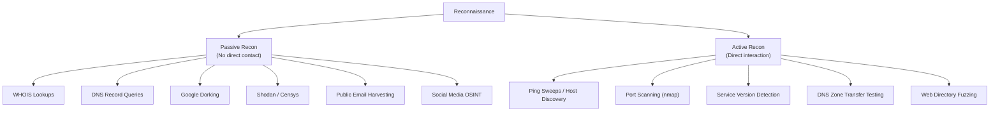
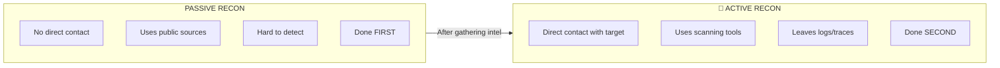
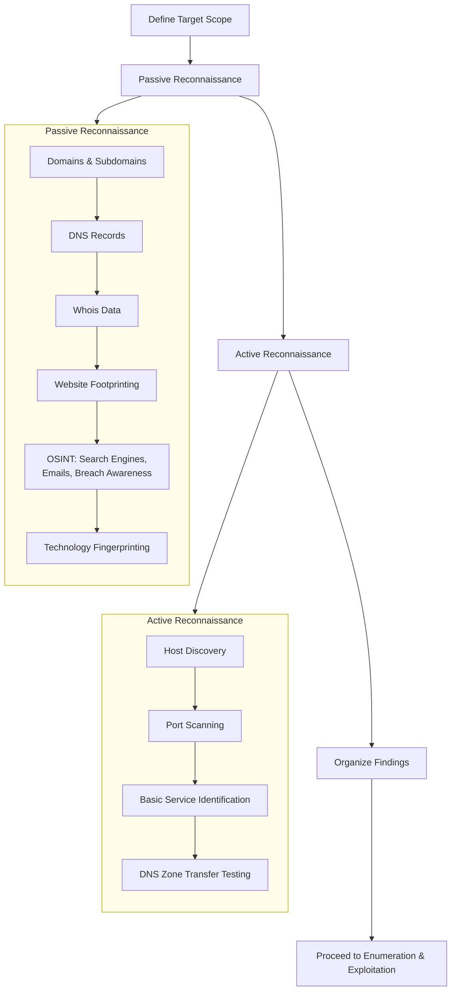
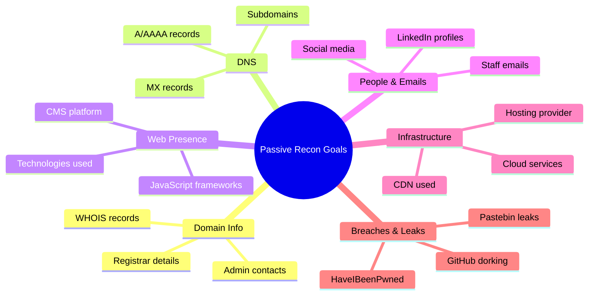
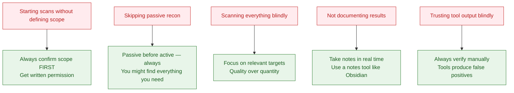

#  Reconnaissance — Passive vs Active

> [!abstract] Lesson Objective By the end of this note, you will understand:
> 
> - The **difference** between passive and active reconnaissance
> - A **repeatable 4-step recon strategy** used before any engagement
> - **What data to collect** and why it matters
> - **Common beginner mistakes** and how to avoid them

---

##  What is Reconnaissance?

Reconnaissance (recon) is the **first phase of any penetration test or ethical hacking engagement**. Before you ever run a single scan or exploit, you need to understand your target.

Think of it like a **detective investigating a crime scene** — you gather clues before jumping to conclusions. The more information you collect about a target, the better your attack surface map will be.

> [!tip] Simple Definition **Reconnaissance = Gathering information about a target before attacking it.**

---

##  The Two Types of Reconnaissance



---

##  Passive Reconnaissance

### What is it?

Passive recon is gathering information **without ever directly touching the target system**. You're using third-party sources — public databases, search engines, archived data.

> [!info] Key Characteristics
> 
> -  **No direct connection** to the target's servers
> -  **Very low risk of detection** — the target never sees your traffic
> -  **Always done first** before active recon
> -  Completely legal when using public sources

---

###  What Data Can You Collect Passively?

|Category|What You Find|Example Tools|
|---|---|---|
|**Domain Info**|Who owns the domain, registration dates, registrar|WHOIS, ViewDNS|
|**DNS Records**|Subdomains, mail servers, IP addresses|DNSdumpster, dig|
|**Web Content**|Technologies used, pages, login portals|BuiltWith, Wappalyzer|
|**Search Engine**|Exposed files, login pages, sensitive info|Google Dorks|
|**Emails**|Staff email addresses for phishing|hunter.io, theHarvester|
|**Breaches**|Leaked passwords or credentials|HaveIBeenPwned|
|**Infrastructure**|Hosting provider, CDN, cloud services|Shodan, Censys|

---

###  Real-World Example — Passive Recon on `example.com`

```
Target: example.com

Step 1 — WHOIS Lookup
  → Registrar: GoDaddy
  → Registered: 2005-08-14
  → Admin Email: admin@example.com ← potential phishing target

Step 2 — DNS Records (dig / DNSdumpster)
  → A record:      93.184.216.34  (main server IP)
  → MX record:     mail.example.com  (mail server)
  → NS records:    ns1.example.com, ns2.example.com
  → Subdomain:     dev.example.com ← interesting! dev server exposed?

Step 3 — Google Dorking
  → site:example.com filetype:pdf  ← finds exposed documents
  → site:example.com inurl:login   ← finds login pages
  → "example.com" "password"       ← finds potential leaks

Step 4 — Shodan
  → Open port 22 (SSH) on 93.184.216.34
  → Running Apache 2.4.29 (outdated version!)
```

> [!success] What You Learned Without Touching the Target
> 
> - Main IP address
> - Mail server location
> - A potentially vulnerable dev subdomain
> - Outdated Apache version
> - Admin email for social engineering

---

##  Active Reconnaissance

### What is it?

Active recon involves **directly sending traffic to the target**. This means you're probing, scanning, or querying the target's systems directly — and they might notice.

> [!warning] Key Characteristics
> 
> -  **Sends traffic directly** to target servers
> -  **Can be detected** by firewalls, IDS/IPS systems
> -  **Leaves logs** on the target system
> -  Done **after passive recon** to confirm and expand findings

---

###  What Data Can You Collect Actively?

|Category|What You Find|Example Tools|
|---|---|---|
|**Live Hosts**|Which IPs are actually online|nmap -sn, fping|
|**Open Ports**|Which doors are open on the server|nmap, masscan|
|**Services**|What is running on each port|nmap -sV|
|**OS Detection**|What operating system is running|nmap -O|
|**DNS Zone Transfer**|Full DNS zone if misconfigured|dig AXFR|
|**Web Directories**|Hidden pages and folders|gobuster, dirb|
|**Banners**|Service version info via banner grabbing|netcat, telnet|

---

###  Real-World Example — Active Recon on `93.184.216.34`

```bash
# Step 1 — Host Discovery (Is it alive?)
$ nmap -sn 93.184.216.34
  → Host is up (0.011s latency)

# Step 2 — Port Scan (What's open?)
$ nmap -p- 93.184.216.34
  → PORT   STATE  SERVICE
     22/tcp open   ssh
     80/tcp open   http
    443/tcp open   https
   3306/tcp open   mysql  ← database exposed to internet!

# Step 3 — Service Version Detection
$ nmap -sV -p 22,80,443,3306 93.184.216.34
  → 22/tcp  OpenSSH 7.2p2 Ubuntu (old version, known CVEs)
  → 80/tcp  Apache httpd 2.4.29
  → 443/tcp Apache httpd 2.4.29
  → 3306/tcp MySQL 5.7.32

# Step 4 — DNS Zone Transfer Attempt
$ dig AXFR example.com @ns1.example.com
  → FAILED (server not misconfigured)
  → But on dev.example.com...
$ dig AXFR dev.example.com @ns1.example.com
  → SUCCESS! Full zone dumped — reveals internal hostnames
```

> [!danger] What You Found by Actively Probing
> 
> - MySQL database is **publicly exposed on port 3306** — critical vulnerability
> - OpenSSH version has **known CVEs**
> - Dev subdomain has a **misconfigured DNS zone transfer**

---

##  Passive vs Active — Side-by-Side Comparison



|Feature|Passive|Active|
|---|---|---|
|**Target Interaction**|None|Direct|
|**Detection Risk**|Very Low|Medium–High|
|**Speed**|Slower (research-based)|Faster (automated)|
|**Data Type**|Public info, metadata|Live system responses|
|**When to Use**|Always — start here|After passive recon|
|**Example Tool**|WHOIS, Google, Shodan|nmap, gobuster, dig|

---

##  Full Recon Mapping Flow



---

##  4-Step Recon Strategy

### Step 1 — Define Target Scope

Before doing anything, answer these questions:

> [!question] Scope Checklist
> 
> - What domain(s) am I allowed to test?
> - What IP ranges are in scope?
> - Are subdomains included?
> - Is cloud infrastructure (AWS, Azure) included?
> - Are there any off-limit systems?

**Example scope definition:**

```
In Scope:
  - example.com and all subdomains
  - 93.184.216.0/24 (IP range)
  - *.example.com

Out of Scope:
  - partner.example.com (third-party hosted)
  - Production database servers
```

---

### Step 2 — Passive Reconnaissance

Your goal: **build a picture of the target using only public data.**



---

### Step 3 — Active Reconnaissance

Your goal: **confirm what's actually live and what's exposed.**

> [!example] Typical Active Recon Commands
> 
> ```bash
> # Discover live hosts
> nmap -sn 10.0.0.0/24
> 
> # Full port scan
> nmap -p- -T4 10.0.0.5
> 
> # Service and version detection
> nmap -sV -sC 10.0.0.5
> 
> # OS Detection
> nmap -O 10.0.0.5
> 
> # Web directory fuzzing
> gobuster dir -u http://example.com -w /usr/share/wordlists/dirb/common.txt
> 
> # DNS zone transfer attempt
> dig AXFR example.com @ns1.example.com
> ```

---

### Step 4 — Document & Organize Findings

> [!important] Why Documentation Matters Without proper documentation, you will:
> 
> - Repeat work you've already done
> - Miss findings when writing your report
> - Lose track of which hosts you've tested
> - Waste time during the exploitation phase

**Recommended documentation format:**

```markdown
## Target: example.com

### Domains & Subdomains
- example.com → 93.184.216.34
- dev.example.com → 93.184.216.50 ← interesting
- mail.example.com → 93.184.216.10

### Open Ports (93.184.216.34)
| Port | Service | Version | Notes |
|------|---------|---------|-------|
| 22   | SSH | OpenSSH 7.2p2 | Known CVEs exist |
| 80   | HTTP | Apache 2.4.29 | Outdated |
| 443  | HTTPS | Apache 2.4.29 | Outdated |
| 3306 | MySQL | 5.7.32 | EXPOSED! Critical |

### Credentials / Emails Found
- admin@example.com (from WHOIS)
- john.doe@example.com (from LinkedIn)

### Potential Attack Vectors
1. MySQL exposed on port 3306
2. Outdated Apache (check CVEs)
3. dev.example.com subdomain (zone transfer succeeded)
```

---

## Common Mistakes (and How to Avoid Them)



---

##  Key Takeaways

> [!summary] What You Should Remember
> 
> 1. **Scope first** — never start without knowing what you're allowed to touch
> 2. **Passive before active** — always gather public info before sending any traffic
> 3. **Recon is about mapping** — your goal is to understand the target, not attack it yet
> 4. **Document everything** — your notes are your map for the rest of the engagement
> 5. **Don't trust tools blindly** — verify interesting findings manually

---

##  Useful Tools Reference

|Tool|Type|Use Case|
|---|---|---|
|`whois`|Passive|Domain registration info|
|`dig` / `nslookup`|Passive/Active|DNS records & zone transfers|
|DNSdumpster|Passive|Subdomain enumeration|
|Shodan / Censys|Passive|Internet-wide device search|
|theHarvester|Passive|Email & subdomain harvesting|
|hunter.io|Passive|Email finding|
|HaveIBeenPwned|Passive|Breach/leak checking|
|BuiltWith / Wappalyzer|Passive|Technology fingerprinting|
|`nmap`|Active|Port scanning & service detection|
|`gobuster` / `dirb`|Active|Web directory fuzzing|
|`masscan`|Active|Fast large-scale port scanning|
|Amass|Active/Passive|Subdomain enumeration|

