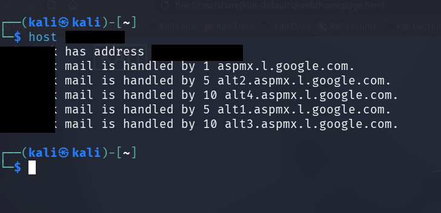

#  Website Recon & Footprinting

> [!abstract] Overview This note covers **Passive Reconnaissance** and **Footprinting** — two critical phases in ethical hacking and penetration testing. We learn _what_ to look for, _why_ it matters, and _how_ to find it without touching the target directly.


##  What is Passive Reconnaissance?

> [!info] Definition **Passive Reconnaissance** is the process of gathering information about a target _without directly interacting with it_. You rely on publicly available data — search engines, DNS records, public databases, etc.

**Why passive?**

- Leaves **no trace** on the target's systems
- Cannot be detected by intrusion detection systems (IDS)
- Fully **legal** when done on authorized targets

---

##  What is Footprinting?

> [!tip] Footprinting vs Recon Footprinting is essentially **advanced reconnaissance**. While recon gives you a broad picture, footprinting digs deeper into a _specific target_ to gather highly relevant, actionable intelligence.

```
Reconnaissance  →  Wide net, general info
Footprinting    →  Focused, target-specific, detailed
```

---

##  What Are We Looking For?

> [!example] Target Information Checklist

|Category|Examples|
|---|---|
| **IP Addresses**|`192.168.1.1`, server IP, CDN IPs|
| **Directories**|`/admin`, `/backup`, `/uploads`|
| **Names**|Employees, developers, admins|
| **Email Addresses**|`admin@target.com`, `support@target.com`|
| **Phone Numbers**|Contact numbers on the site|
| **Physical Address**|Office location, data center|
| **Technologies**|CMS, web server, frameworks, SSL certs|

---

##  Common Steps & Tools

### Step 1 — Identify Tools in Kali Linux

> [!tip] Quick Tip: `whatis` Command Before using any tool, use `whatis` to understand what it does.

```bash
# Syntax
whatis <toolname>

# Example
whatis host
```

**Output:**![[Pasted image 20260330192055.png]]

```
host (1) - DNS lookup utility
```

---

### Step 2 — Find the IP Address with `host`

> [!info] The `host` Tool `host` is a simple DNS lookup utility used to find the IP address associated with a domain name.

```bash
# Syntax
host <domain>

# Example
host www.tesla.com
```

**Sample Output:**

```
www.tesla.com has address 184.31.3.173
www.tesla.com has IPv6 address 2001:db8::1
```




---

### Step 3 — Check `robots.txt`

> [!warning] Often Overlooked but Goldmine! `robots.txt` is meant to tell search engine crawlers which pages _not_ to index — but it often reveals **hidden directories** the admin wants to keep private!

```
# How to access it
https://www.target.com/robots.txt
```

**Example `robots.txt` content:**

```
User-agent: *
Disallow: /admin/
Disallow: /backup/
Disallow: /internal-api/
Disallow: /staging/
```

> [!danger]  Notice what was revealed?
> 
> - `/admin/` — Admin panel
> - `/backup/` — Backup files (potentially sensitive!)
> - `/internal-api/` — Internal API endpoint
> - `/staging/` — Staging environment

---

### Step 4 — Check `sitemap.xml`

> [!info] What is sitemap.xml? A **sitemap** is an XML file that lists all the pages of a website in an organized way — designed to help search engines index the site. For us, it maps out the **entire structure** of the website!

```
# How to access it
https://www.target.com/sitemap.xml
```

**Example `sitemap.xml` snippet:**

```xml
<?xml version="1.0" encoding="UTF-8"?>
<urlset xmlns="http://www.sitemaps.org/schemas/sitemap/0.9">
  <url>
    <loc>https://target.com/</loc>
  </url>
  <url>
    <loc>https://target.com/contact</loc>
  </url>
  <url>
    <loc>https://target.com/about/team</loc>  <!-- Names! -->
  </url>
  <url>
    <loc>https://target.com/portal/login</loc>  <!-- Login portal! -->
  </url>
</urlset>
```

> [!success] What we learn
> 
> - Full list of **accessible pages**
> - Possible **login portals**
> - **Team/staff pages** that may contain names and emails

---

### Step 5 — Identify Web Technologies

We have two main approaches:

####  Browser Extension: BuiltWith / Wappalyzer

> [!tip] Browser Extensions Install **BuiltWith** or **Wappalyzer** as a browser extension. Simply visit the target site and click the extension icon to reveal all technologies used.

**Example output from Wappalyzer on a target:**

```
CMS:         WordPress 6.4
Web Server:  Apache 2.4.54
Programming: PHP 8.1
Analytics:   Google Analytics
CDN:         Cloudflare
SSL:         Let's Encrypt
```

---

####  Kali Linux Tool: `whatweb`

> [!info] WhatWeb — The Swiss Army Knife `whatweb` is a built-in Kali tool that aggressively fingerprints websites and returns detailed technology information from the command line.

```bash
# Basic usage
whatweb <target>

# Example
whatweb https://www.target.com

# Verbose mode (more detail)
whatweb -v https://www.target.com

# Aggressive mode
whatweb -a 3 https://www.target.com
```

**Sample Output:**

```
https://www.target.com [200 OK]
  Apache[2.4.54]
  Country[UNITED STATES][US]
  Email[admin@target.com]
  HTML5
  HTTPServer[Ubuntu Linux][Apache/2.4.54 (Ubuntu)]
  IP[93.184.216.34]
  OpenSSL[1.1.1]
  PHP[8.1.12]
  WordPress[6.4.2]
  X-Powered-By[PHP/8.1.12]
```

> [!success] What we learn from WhatWeb
> 
> - **Server OS**: Ubuntu Linux
> - **Web Server**: Apache 2.4.54 (check for CVEs!)
> - **Email**: `admin@target.com` (social engineering target)
> - **CMS**: WordPress 6.4.2 (check for plugin vulnerabilities)
> - **PHP Version**: 8.1.12
> - **IP Address**: 93.184.216.34

---

##  Footprinting Workflow (Visual Summary)

```
┌─────────────────────────────────────────────────┐
│              TARGET: www.example.com             │
└──────────────────────┬──────────────────────────┘
                       │
          ┌────────────▼────────────┐
          │   1. host command       │
          │   → Find IP Address     │
          └────────────┬────────────┘
                       │
          ┌────────────▼────────────┐
          │   2. /robots.txt        │
          │   → Hidden Directories  │
          └────────────┬────────────┘
                       │
          ┌────────────▼────────────┐
          │   3. /sitemap.xml       │
          │   → Site Structure,     │
          │     Staff Pages         │
          └────────────┬────────────┘
                       │
          ┌────────────▼────────────┐
          │   4. whatweb / BuiltWith│
          │   → Technologies, Emails│
          │     Server versions     │
          └────────────┬────────────┘
                       │
          ┌────────────▼────────────┐
          │      INTELLIGENCE       │
          │   REPORT COMPILED       │
          └─────────────────────────┘
```

---

##  Full Recon Checklist

> [!todo] Passive Recon Checklist
> 
> -  Run `host <domain>` — get IP
> -  Check `robots.txt` — find hidden paths
> -  Check `sitemap.xml` — map site structure
> -  Run `whatweb <domain>` — enumerate technologies
> -  Use BuiltWith/Wappalyzer browser extension
> -  Note all emails found
> -  Note all names/staff found
> -  Record all technology versions (check CVEs later)
> -  Note physical address if found
> -  Record phone numbers

---

##  Quick Reference — Commands

```bash
# Identify a tool
whatis <toolname>

# DNS/IP lookup
host <domain>

# Web technology fingerprinting
whatweb <domain>
whatweb -v <domain>          # verbose
whatweb -a 3 <domain>        # aggressive

# Manual checks (browser)
https://<domain>/robots.txt
https://<domain>/sitemap.xml
```

